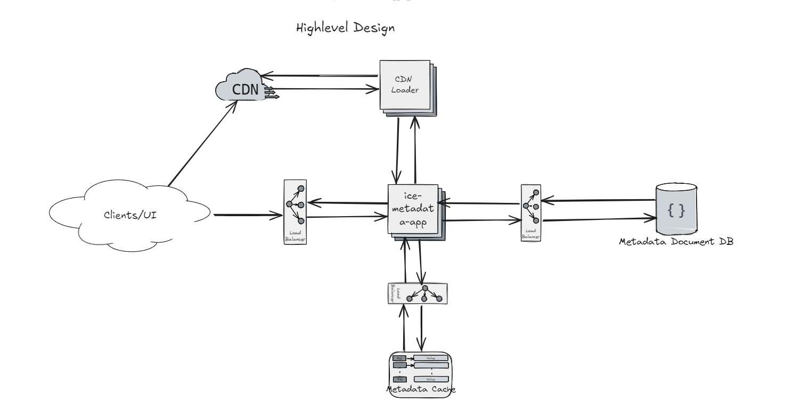

Tech Stack:
```
Scala 2.13
PlayFramework
```

Compile and Test:
```
$sbt compile
$sbt test
```

Run:
```
$sbt run
```

APIs:
```
1. http POst app/v1/tracks -> add the new track

2. http PUT app/v1/artists/<id> -> edit the artist info 

3. http GET app/v1/artists/<id>/tracks -> get all tracks associated with artist

4. http GET app/v1/artists/artist-of-the-day -> get the artist of the day 
```

HighLevel Design

